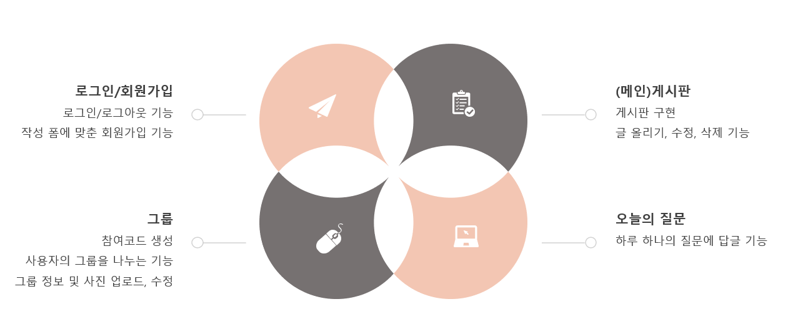

# 멀티캠퍼스 인터페이스 개발 프로젝트

진행기간 : 2021.02.02 ~ 2021.02.19

주제 : 질의응답형 Web Application 개발

팀원 : 이승호(팀장), 송혜인, 박민정

## 주요 서비스

## 사용 기술

* Python, JavaScript

* Django

* MySQL

  

## 맡은 역할

* 메인 페이지 구현
* 메인 페이지 달력 및 달력 이벤트 처리
* 그룹 게시판 구현
* 그룹 게시판 조회, 수정, 삭제 기능 구현

## 발표자료

* [프로젝트 포트폴리오](/Presentation_Paple.pdf)